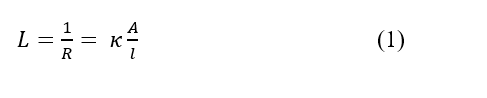
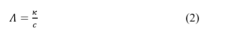
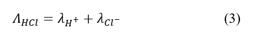
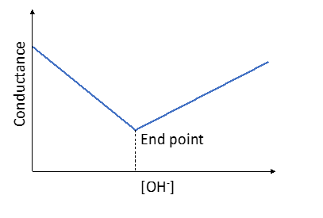

An electrolytic solution is capable to conduct current due to the presence of ions that act as a charge carrier in the solution. For such a system it is more convenient to describe the current flowing capacity by the conductance, L, (in mhos or ohms–1), rather than by the resistance, R. Nevertheless, they are related as :  

 

The resistance (R) depends upon the nature and geometry of the conductor and κ is the specific conductance, i.e., the conductance of a tube of material 1 cm long having a cross section of 1 cm2. The unit of κ is mho cm–1.  

The equivalent conductance (Λ: cm2 Ohm–1 mole–1) is defined as the conductance of a solution containing 1 gm-equivalent of electrolyte such that the entire solution is placed between two electrodes 1 cm apart. The specific conductance of an electrolyte solution is related to equivalent conductance by :  

  

Strong electrolytes, such as HCl, dissociate fully into ions when dissolved in water and the conductance of this solution can be written as the summation of the individual ionic conductance :  

  

The principle of conductometric titration is based on the fact that during the titration, one of the ions is replaced by the other and invariably these two ions differ in the ionic conductivity with the result that conductivity of the solution varies during the course of titration. The equivalence point may be located graphically by plotting the change in conductance as a function of the volume of titrant added. 

 
<b>Figure 1.</b> Conductometric titration of HCl with NaOH  

Now consider the case where HCl is being titrated with a strong base NaOH as titrant. Before NaOH is added, the conductance is high due to the presence of highly mobile hydrogen ions, as given by equation (3). When the base is added, the conductance falls due to the replacement of hydrogen ions by the added Na+ cation which has very less ionic conductance than H+ as H+ ions react with OH- ions to form undissociated water as follows:   

H+(aq) + Cl-(aq) + Na+(aq) + OH-(aq) → Na+(aq) + Cl-(aq) + H2O(l)   

This decrease in the conductance continues till the equivalence point (Fig. 1). At the equivalence point, the solution contains only NaCl. After the equivalence point, the conductance increases due to the large conductivity of OH- ions.   

The strength of the acid can now be calculated via the formula: S2 = (V1S1)/V2, where S2 is the strength of the acid, V1 is the volume of NaOH added at the equivalence point, S1 is the strength of the NaOH (already known) and V2 is the volume of HCl (V2) (also known).

