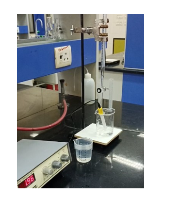
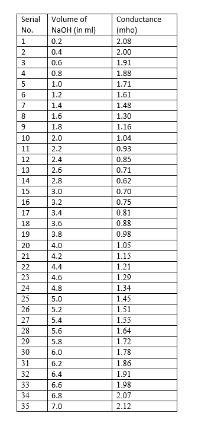
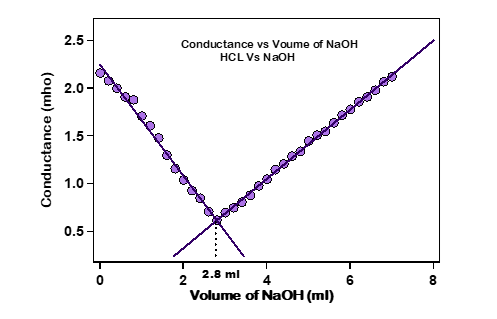
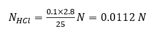

<b>Apparatus & Chemicals : </b> 
A.	Conductivity meter  
B.	Conductivity cell  
C.	Burette, Funnel, pipette, Beaker  
D.	0.1(N) NaOH (pre-calibrated)  
E.	HCl solution  
F.	Distilled Water   

<b>Procedure in laboratory : </b> 
A.	Take a standardized 0.1(N) NaOH solution in 50ml burette and adjust zero reading. 
B.	Pipette out 25ml of given HCl solution in a 100/150 ml beaker and add 25 ml water to this. 
C.	Now add the NaOH solution from burette on (~ 2 drops) 0.2 ml increments in the beaker and record the conductance after mixing the solution. 
D.	Continue the recording till you reached the initial conductance. 
E.	Repeat the experiments twice. 
F.	Plot the graph of volume of NaOH v/s Conductance and determine the equivalence point of the titration. 
G.	Calculate the normality of HCl solution. 

  

<b>Precautions : </b> 
A.	Conductivity meter should be properly calibrated. 
B.	Mixture should be properly stirred before taking reading , volume of NaOH poured must be correctly measured. 
C.	There should be no air in the burette.  

<b>Data and the analysis : </b> 
  

<b>Graph : </b> 
  

<b>Analysis : </b> 

From the graph, we get 2.8 ml of NaOH required to reach the equivalence point. 

The unknown concentration of HCl can determined as 
VHCL × NHCL = VNaOH × NNaOH

where <b>VHCl</b> = Volume of HCl taken (25ml), <b>NHCl</b> = Conc. we have to find out, <b>VNaOH</b> = Volume of NaOH added (2.8 ml), <b>NNaOH</b> = Conc. of NaOH in normality (0.1 N)  

  

